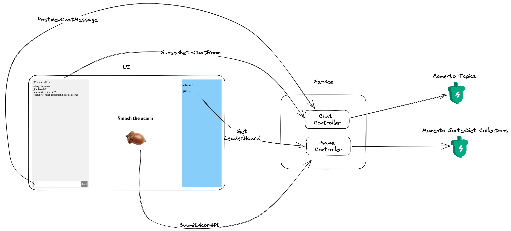

# acorn-smash

Welcome to the Acorn Smash a fun Idle Clicker inspired game with player Chat to showcase Momento capabilities!

### Requirements

- [Go version 1.18](https://go.dev/dl/) or newer.
- A Momento Auth Token is required, you can generate one using
  the [Momento CLI](https://github.com/momentohq/momento-cli)


### Running
```console
go mod vendor
MOMENTO_AUTH_TOKEN=<replace-me> go run main.go
```

Architecture:


