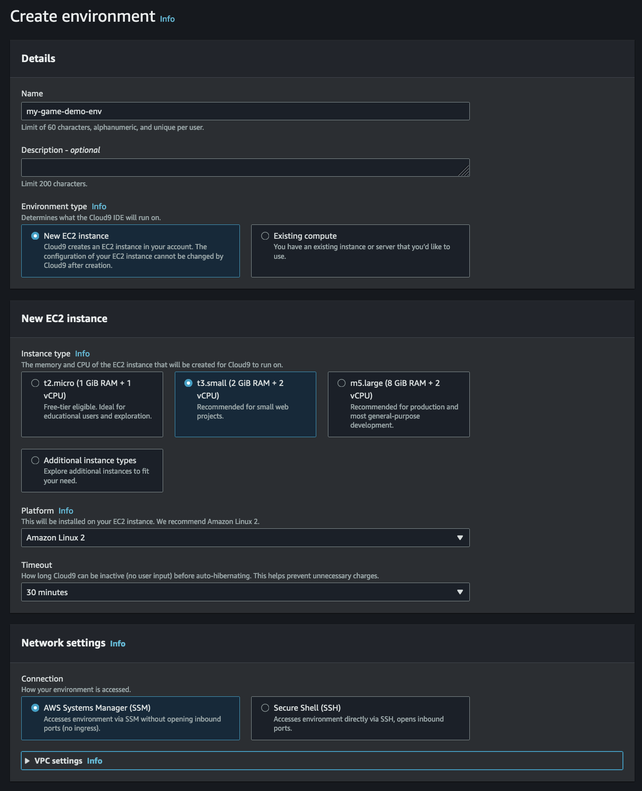
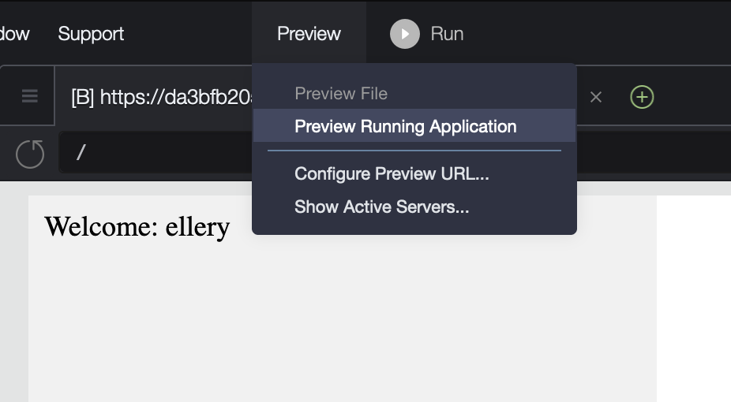
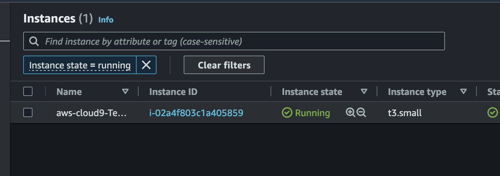
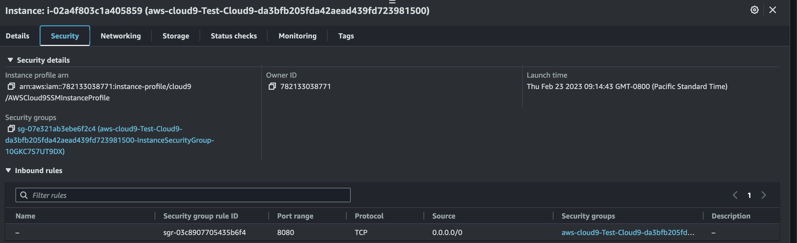

# cloud 9 setup instructions

Here are some instructions for setting up a cloud 9 environment in an AWS account to allow you to easily get up and 
running with this demo.

1. Sign up for a momento account (make sure to pick same region for cloud9 and momento when testing)
   1. You can use our [online CLI experience](https://play.instruqt.com/embed/momento/tracks/sandbox-container-1challenge?token=em_14J4EucaTHzL0rXw&finish_btn_target=_top&finish_btn_text=Return+to+Docs&finish_btn_url=https%3A%2F%2Fdocs.momentohq.com%2Fgetting-started#try-our-cli-and-an-sdk-in-your-browser) 
   2. Or follow the instructions [here](https://docs.momentohq.com/getting-started#install-the-momento-command-line-interface-cli) for doing right from your laptop
2. Log in to your AWS account and navigate to the [Cloud9 Service](https://us-west-2.console.aws.amazon.com/cloud9control/home?region=us-east-1#/product) you should see a screen like this:
   
3. Then click on the orange "Create Environment" button we are going to set up a environment to use for developing and running this demo. You should use the default settings for your environment except we are going to  use a t3.small instance. The setting should look like this:
    
4. Once the environment spins up and you are dropped into your Cloud 9 IDE open the terminal and run the following command to clone this repo down 
    `git clone https://github.com/momentohq/acorn-smash-demo.git`
5. Then switch into directory that was cloned with `cd acorn-smash-demo`
6. You should now be ready to run the demo with following commands
   1. Sync Dependencies `go mod vendor`
   2. Start service with momento auth token obtained in step 1
        `MOMENTO_AUTH_TOKEN=<replace-me> go run main.go`
   3. Then click Preview Running Application in drop down on top to preview the game in your IDE browser:
      
7. (optional) Open up cloud9 instance so can expose service and try from multiple clients.
   1. Go to your running instances on [Ec2 Service page](https://us-east-1.console.aws.amazon.com/ec2/home?region=us-east-1#Instances:instanceState=running) and find your instance that is powering your cloud9 IDE and make a note of the public IP address assigned to it. It should look like this:
        
   2. Select the instance and navigate to the security tab to find the security group that was created for the instance and modify the ingress rules to allow traffic on port 8080:
      
   3. You should now be able to open up any browser tab with the public ip of your test instance on port 8080 and test multiple clients with your hosted version of the game.
